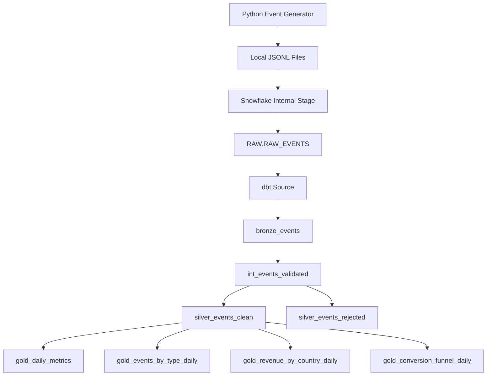

# Architecture

This project follows an ELT architecture using Snowflake and dbt.

## High-level Flow



## Layer Responsibilities

### Raw

Stores the original JSON event data as semi-structured `VARIANT`.

Purpose:

* preserve the source data
* allow rebuilds from raw
* keep loading logic separate from transformation logic

### Bronze

Parses raw JSON into typed columns.

Purpose:

* extract event fields
* cast timestamps and numeric values
* make raw data easier to query

### Silver

Applies validation, deduplication, and business rules.

Purpose:

* keep clean valid events
* separate rejected records
* make data quality issues observable

### Gold

Creates business-ready analytics tables.

Purpose:

* daily active users
* revenue metrics
* event distribution
* revenue by country
* user conversion funnel

## dbt Lineage

The dbt model flow is:

```text
source.raw.raw_events
   ↓
bronze_events
   ↓
int_events_validated
   ↓
silver_events_clean
   ↓
gold_daily_metrics
gold_events_by_type_daily
gold_revenue_by_country_daily
gold_conversion_funnel_daily
```

`silver_events_rejected` also depends on `int_events_validated` and stores invalid or duplicate records with a rejection reason.
